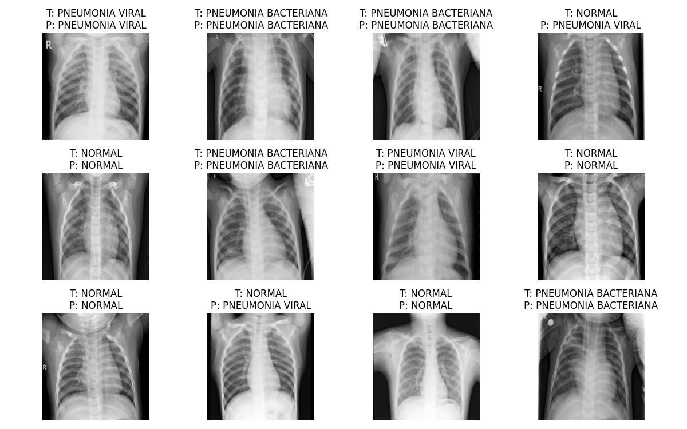

# Pneumonia Convolutional Neural Network
Essa Rede Neural Convolucional foi feita para detectar casos de pneumonia em fotos de raio-x de pulmões.

## Definição da rede neural
```python
class CNN(nn.Module):
    def __init__(self, num_classes):
        super(CNN, self).__init__()
        
        self.features = nn.Sequential(
            nn.Conv2d(1, 32, kernel_size=3, stride=1, padding=1),
            nn.ReLU(inplace=True),
            nn.MaxPool2d(kernel_size=2, stride=2),
            nn.Conv2d(32, 64, kernel_size=3, stride=1, padding=1),
            nn.ReLU(inplace=True),
            nn.MaxPool2d(kernel_size=2, stride=2)
        )
        
        self.classifier = nn.Sequential(
            nn.Dropout(),
            nn.Linear(64 * 56 * 56, 128),
            nn.ReLU(inplace=True),
            nn.Dropout(),
            nn.Linear(128, num_classes),
            nn.LogSoftmax(dim=1)
        )
    
    def forward(self, x):
        x = self.features(x)
        x = x.view(x.size(0), -1)
        x = self.classifier(x)
        return x
```
Aqui simplesmente definimos nossa classe da CNN utilizando Pytorch.

## Saída de exemplo

Esse projeto foi feito para fins de aprendizado utilizando o dataset obtido em https://www.kaggle.com/datasets/paultimothymooney/chest-xray-pneumonia

---

# Pneumonia Convolutional Neural Network
This Convolutional Neural Network (CNN) was made to predict pneumonia cases from lung x-rays. 

## CNN definition
```python
class CNN(nn.Module):
    def __init__(self, num_classes):
        super(CNN, self).__init__()
        
        self.features = nn.Sequential(
            nn.Conv2d(1, 32, kernel_size=3, stride=1, padding=1),
            nn.ReLU(inplace=True),
            nn.MaxPool2d(kernel_size=2, stride=2),
            nn.Conv2d(32, 64, kernel_size=3, stride=1, padding=1),
            nn.ReLU(inplace=True),
            nn.MaxPool2d(kernel_size=2, stride=2)
        )
        
        self.classifier = nn.Sequential(
            nn.Dropout(),
            nn.Linear(64 * 56 * 56, 128),
            nn.ReLU(inplace=True),
            nn.Dropout(),
            nn.Linear(128, num_classes),
            nn.LogSoftmax(dim=1)
        )
    
    def forward(self, x):
        x = self.features(x)
        x = x.view(x.size(0), -1)
        x = self.classifier(x)
        return x
```
Here we simply define our CNN class using Pytorch.

## Example output

This project was made for learning purposes. It was made using the dataset obtained at https://www.kaggle.com/datasets/paultimothymooney/chest-xray-pneumonia
